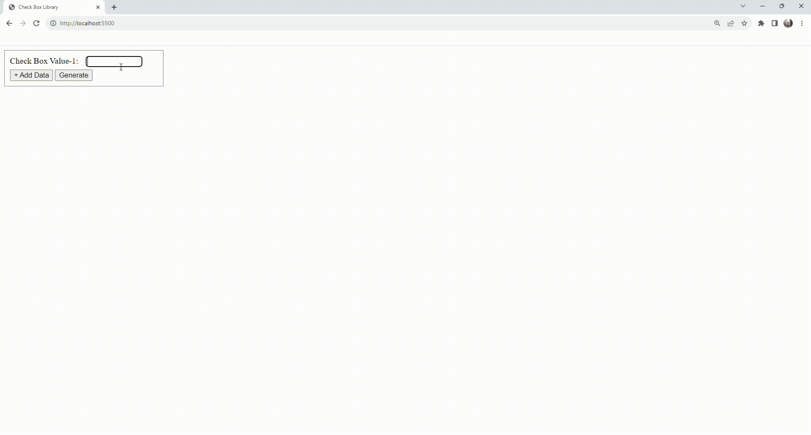

# Challenge 3: DOM Manipulation

Welcome to Challenge 3: DOM Manipulation. 
 
 
As you've finished Front End course, now you have a fundamental of DOM Manipulation with Javascript. And now <b>here's the challenge</b>.
 
 
First,take a look at the example down below.

Now, you have to remake something like To-do List, please follow the criteria down below:
- First write something that you want to do, you can write more than one just like the example.
- After that, make the checkbox containing the To-do List you've added before. There are button that can reset the To-do List and submit the To-do List.
- If you click submit button, it will appear the to-do list that you have done (the points that you've checked) and the to-do list that you haven't done.
- Add some style to make the view looks good as user interface.

That's it for the challenge, see you in the Back End section.
 
 
GLHF!!!