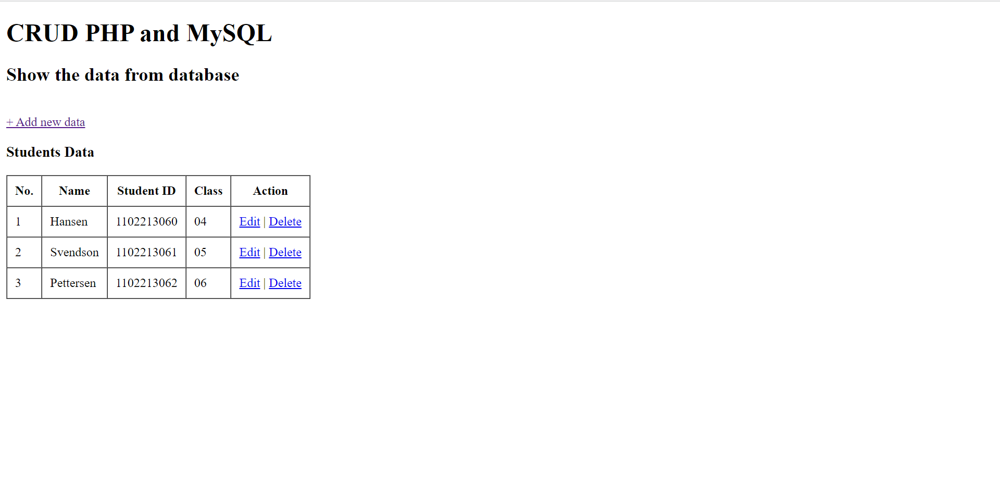

# Show The Data from Database

Alright, you've made the connection in the previous section. The question is "What can we do after that?"
<br>
Remember you have some record in the database? You can show them to the website page. First, you must start you web server and MySQL at your XAMPP or Laragon, then create a file named `index.php` in the folder that we created before and copy this following code:

```php
<!DOCTYPE html>
<html lang="en">
<head>
    <meta charset="UTF-8">
    <meta name="viewport" content="width=device-width, initial-scale=1.0">
    <title>Show the data from Database</title>
</head>
<body>
    <h1>CRUD PHP and MySQL</h1>
    <h2>Show the data from database</h2>
    <?php 
	if(isset($_GET['message'])){
		$message = $_GET['message'];
		if($message == "input"){
			echo "The data has been recorded successfully.";
		}else if($message == "update"){
			echo "The data has been updated successfully.";
		}else if($message == "delete"){
			echo "The data has been deleted successfully.";
		}
	}
	?>
	<br/>
	<a class="tombol" href="input.php">+ Add new data</a>
    <h3>Students Data</h3>
    <table border="1" cellpadding="10" cellspacing="0">
        <tr>
            <th>No.</th>
            <th>Name</th>
            <th>Student ID</th>
            <th>Class</th>
            <th>Action</th>
        </tr>
        <?php
        include "connection.php";
        
        $query = mysqli_query($conn, "SELECT * FROM students");

        $no = 1;
        while($data = mysqli_fetch_array($query)){
        ?>
            <tr>
                <td><?php echo $no++ ?></td>
                <td><?php echo $data['name'] ?></td>
                <td><?php echo $data['student_id'] ?></td>
                <td><?php echo $data['class'] ?></td>
                <td>
                    <a class="edit" href="edit.php?id=<?php echo $data['id']; ?>">Edit</a> |
                    <a class="delete" href="delete.php?id=<?php echo $data['id']; ?>">Delete</a>					
                </td>
            </tr>
        <?php
        }
        ?>
    </table>
</body>
</html>
```

If you open in you browser, type `localhost/{your_folder_name}` this page will be appear in your browser:

Quite simple right? You can make the website that shows the data from database. We can go to the next section.

GLHF!