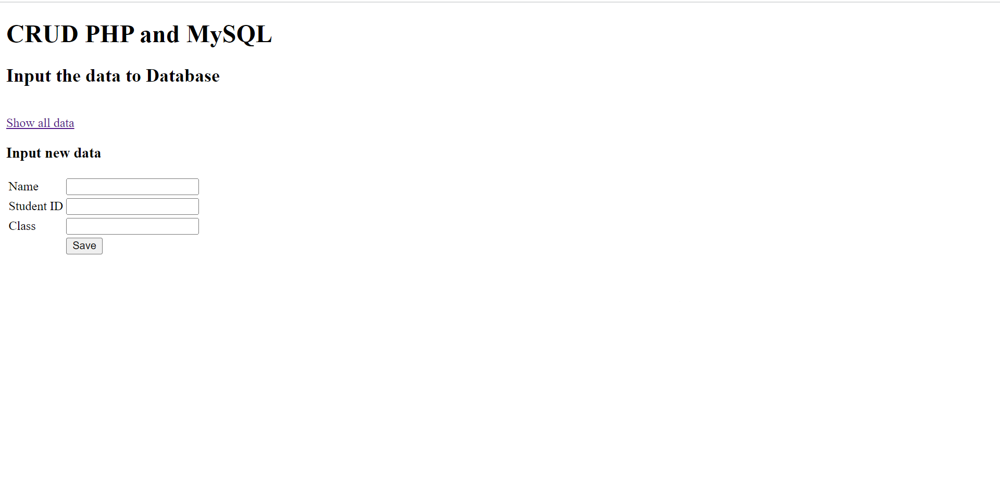
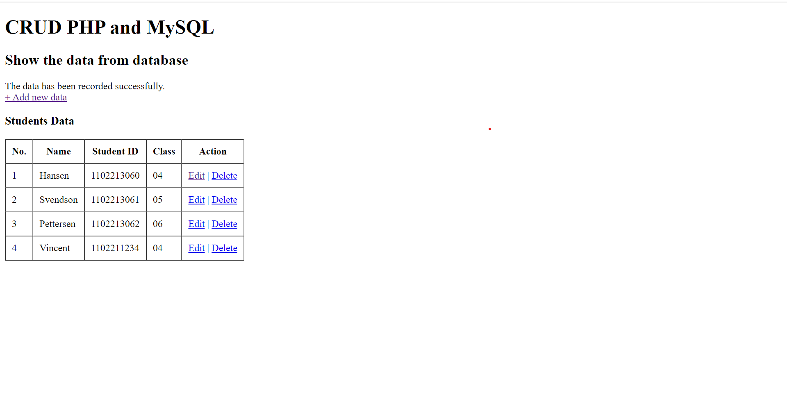

# Store Data

After you can show the data, you can create a program to store the data. But how?

First, you should create files named `input.php` to show the view of the program, and `input-action.php` to store the data that you want to be stored.

You can copy this following code for `input.php`:
```html
<!DOCTYPE html>
<html lang="en">
<head>
    <meta charset="UTF-8">
    <meta name="viewport" content="width=device-width, initial-scale=1.0">
    <title>Input the data to Database</title>
</head>
<body>
    <h1>CRUD PHP and MySQL</h1>
    <h2>Input the data to Database</h2>
	
	<br/>
 
	<a href="index.php">Show all data</a>
 
	<br/>
	<h3>Input new data</h3>
	<form action="input-action.php" method="post">		
		<table>
			<tr>
				<td>Name</td>
				<td><input type="text" name="name"></td>					
			</tr>	
			<tr>
				<td>Student ID</td>
				<td><input type="text" name="student_id"></td>					
			</tr>	
			<tr>
				<td>Class</td>
				<td><input type="text" name="class"></td>					
			</tr>	
			<tr>
				<td></td>
				<td><input type="submit" value="Save"></td>					
			</tr>				
		</table>
	</form>
</body>
</html>
```
In your browser, it should be like this:



For `input-action.php`, you can copy this following code:
```php
<?php 
include 'connection.php';
$name = $_POST['name'];
$student_id = $_POST['student_id'];
$class = $_POST['class'];
 
mysqli_query($conn, "INSERT INTO students (name, student_id, class) VALUES('$name','$student_id','$class')");
 
header("location:index.php?message=input");
?>
```

<strong>What does it mean?</strong>
<br>
`$_POST` is a global variable that containing the data from the form that has `post` method. So `$name`, `$student_id`, and `$class` are assigned by the data that is taken from the input form. Then the data is stored by this syntax:

```php
mysqli_query($conn, "INSERT INTO students (name, student_id, class) VALUES('$name','$student_id','$class')");
```

For example, you want input 'Vincent' as Name, '1102211234' as Student ID, and '04' as Class, the output should be like this:


Alright, you've made a program that can store the data. What's next? We'll see. Let's go to the next section.

Keep it going.

GLHF!